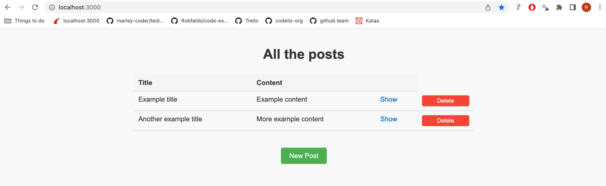
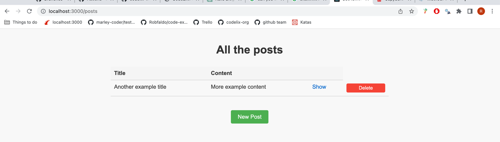

# Rails Trail - Exercise #2

## Getting started

```
# Navigate to the trail folder
cd rails-trail

# Clone this repo
git clone git@github.com:codelix-org/delete-posts.git
cd delete-posts

# Install dependencies
bundle 

# set up database
bundle exec rails db:create
bundle exec rails db:migrate

# create branch
git checkout -b attempt-YOURNAMEHERE

# run specs to see failing spec
bundle exec rspec

# run server 
bundle exec rails s
```

## Exercise instructions

In this exercise you'll be adding a button that allows you to delete a post. 

When you go to http://localhost:3000/ you should see the ability to delete posts like this:



Clicking on the delete button should remove the post from the page. So if I clicked the delete button
for the first post I would then see: 



The testing of this exercise does not check any css. You can style it however you like or you can use the 
css that has been provided (to apply the css for the delete button, give the button the css class of `.delete-post-button`)

You can run the tests locally (`bundle exec rspec`) and ensure they pass before pushing for marking. 

When you've completed the task, push your branch to github and create a PR for the branch.

## Marking this exercise

This exercise is marked automatically by a github action. When you create a PR (or push commits to an opened PR) it will run the specs, and if they pass it will send a notification to Codelix to notify you have passed the exercise.

You should see this updated fairly quickly in www.codelix.co.uk but if you don't you can check the Actions tab in this repo to see if the action failed and reach out to @Robfaldo for help.
